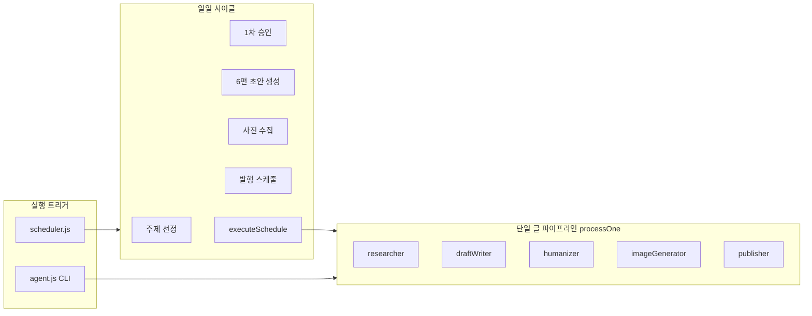
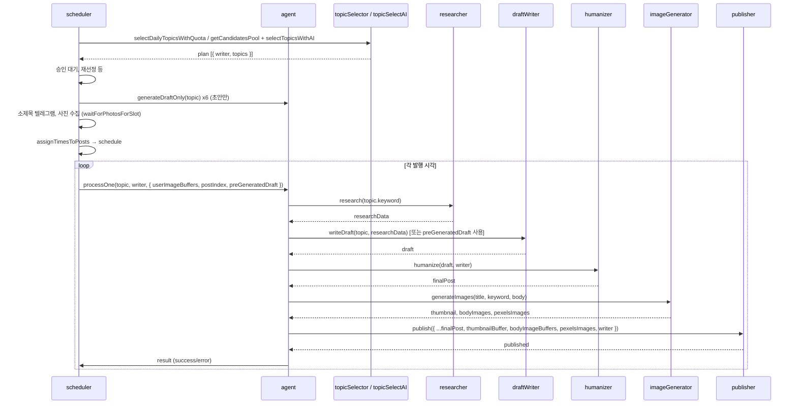

# 자동 블로그 글쓰기 — 소스 구조 분석

## 1. 전체 아키텍처

시스템은 **스케줄러(scheduler)** 가 매일 09:00 KST(또는 텔레그램 "시작")에 **일일 사이클**을 돌리고, 각 글은 **에이전트(agent)** 의 `processOne()` 파이프라인으로 처리됩니다.

- **진입점**
  - [blog/scheduler.js](blog/scheduler.js): 24/7 상주, 매일 09:00 KST 또는 텔레그램 "시작" 시 `dailyCycle()` 실행.
  - [blog/agent.js](blog/agent.js): CLI 직접 실행 시 `main()` 또는 scheduler에서 `processOne`, `generateDraftOnly`, `initAgent`, `cleanupAgent` import.

---

## 2. 디렉터리/파일 구조

| 경로 | 역할 |
|------|------|
| **blog/agent.js** | 단일 글 파이프라인 `processOne`, 초안만 생성 `generateDraftOnly`, CLI용 `main`, init/cleanup |
| **blog/scheduler.js** | 일일 사이클(주제 선정→승인→초안 6편→소제목/사진 수집→스케줄 생성→시간별 발행), 텔레그램 명령 처리 |
| **blog/pipeline/topicSelector.js** | 주제 풀 구성(네이트/네이버/시즌), `getCandidatesPool`, `enrichPoolWithSearchVolume`, `selectDailyTopicsWithQuota`, fallback 랜덤 할당 |
| **blog/pipeline/topicSelectAI.js** | Gemini로 풀에서 6편 선정(작가별 2개), `selectTopicsWithAI` |
| **blog/pipeline/researcher.js** | 네이버 뉴스/블로그 검색, `research(keyword)` → 리서치 텍스트 |
| **blog/pipeline/draftWriter.js** | Gemini( gemini-3-pro-preview → gemini-2.5-flash fallback)로 초안 생성, `writeDraft(topic, researchData)` → `{ title, metaDescription, body, tags }` |
| **blog/pipeline/humanizer.js** | Claude Sonnet으로 작가 페르소나 적용, `humanize(draft, writer)` |
| **blog/pipeline/imageGenerator.js** | Imagen/Gemini 썸네일·본문 AI 이미지 + Pexels 실사, `generateImages(title, keyword, bodyHtml)` |
| **blog/pipeline/publisher.js** | Ghost Admin API: 이미지 업로드, 본문에 이미지 삽입, 작가 지정, `status: 'draft'`로 발행 |
| **blog/writers.js** | 3인 작가 정의(id, nickname, categories, persona), `selectWriter`, `getWriterById` |
| **blog/utils/** | dedup(Redis+파일), telegram, pexelsSearch, naverTopics, nateTrends, searchVolume, requiredPages 등 |

---

## 3. 데이터 흐름 (글 1편 기준)

- **topic** 구조: `{ keyword, category, source, sourceTag?, rationale?, draft?, searchVolumeLabel? }`
- **draft/finalPost**: `{ title, metaDescription, body, tags }` (humanizer 후 `writerNickname` 추가)
- **publish 옵션**: `thumbnailBuffer`, `bodyImageBuffers`, `pexelsImages`, `writer` → Ghost에 작가 지정, 이미지 h2 뒤 분산 삽입

---

## 4. 설정/상수 (주요 위치)

- **scheduler.js**: `POSTS_PER_WRITER=2`, `PUBLISH_START_HOUR=11`, `PUBLISH_END_HOUR=22`, `MIN_GAP_MINUTES=60`, `SAME_WRITER_GAP_MINUTES=180`, `APPROVAL_TIMEOUT_MS=4h`
- **draftWriter.js**: `MODEL='gemini-3-pro-preview'`, `FALLBACK_MODEL='gemini-2.5-flash'`, 단어 수 범위/소제목 개수/CTA 풀
- **humanizer.js**: `CLAUDE_MODEL='claude-sonnet-4-5'`
- **publisher.js**: `status: 'draft'` (공개 시 `'published'`로 변경 필요), Ghost URL은 `GHOST_URL` env

---

## 5. 외부 의존성

- **API/서비스**: Gemini, Claude, Ghost Admin API, 네이버 검색 API, Pexels, (선택) Redis
- **환경변수**: `GEMINI_API_KEY`, `GHOST_ADMIN_API_KEY`, `CLAUDE_API_KEY`, `TELEGRAM_*`, `NAVER_CLIENT_*`, `PEXELS_API_KEY`, `REDIS_HOST` 등
- **데이터 파일**: `blog/calendar.json`(시즌), `blog/data/published-keywords.json`(dedup 파일 fallback)

---

## 6. 다음 단계

구조 파악을 바탕으로, **문제점**과 **개선할 점**을 구체적으로 정리하면 해당 위치를 짚어서 원인 분석 및 수정/개선 방안을 제안할 수 있습니다.
